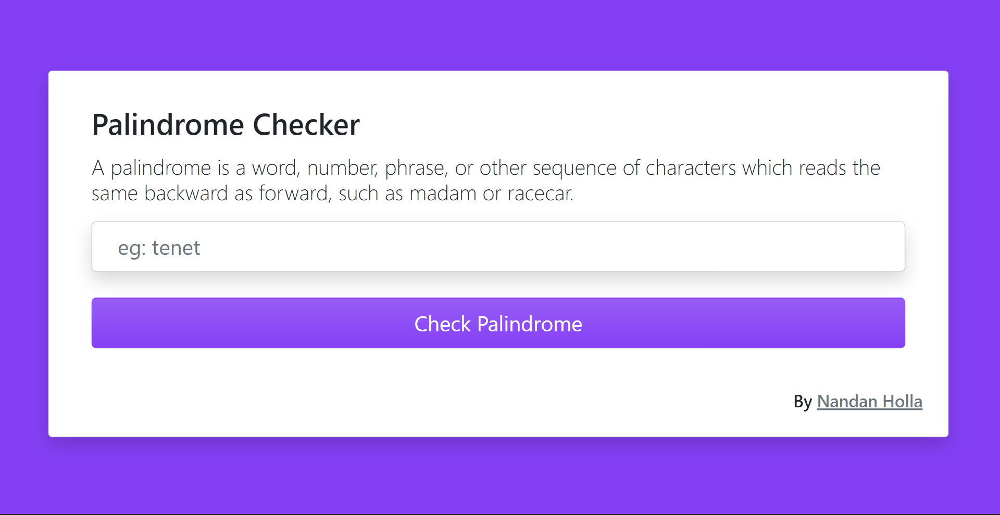
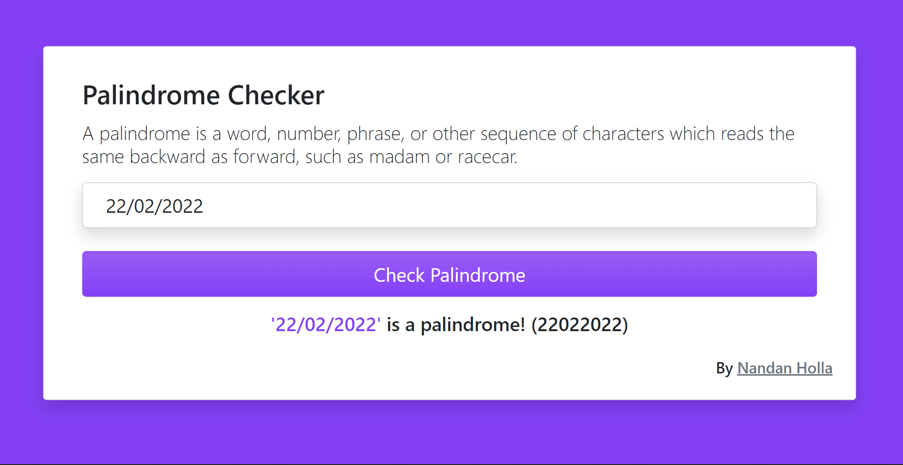
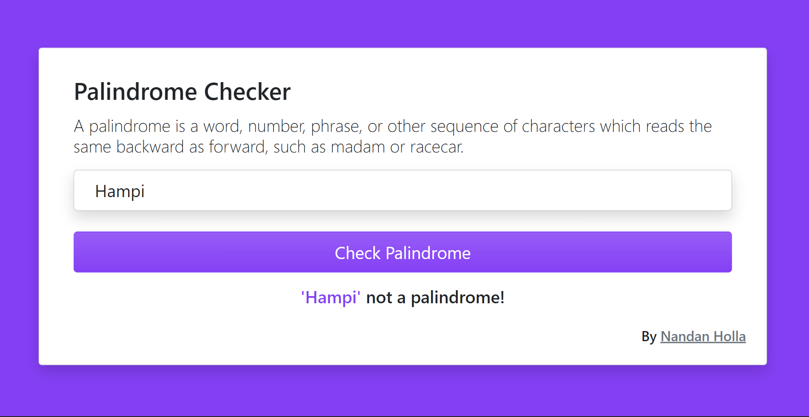

# Palindrome Checker

A palindrome is a word, number, phrase, or other sequence of characters which reads the same backward as forward ignoring punctuation, case, and spacing.

This application asks a user for a phrase or a word. It checks the user input, runs palindrome check on it, and tells user whether the entered string is a palindrome or not.


## Demo

https://nandanholla.github.io/palindrome-checker


## Screenshots 📸






## Some of the famous palindromes 🌟

* A Man, A Plan, A Canal-Panama!
* Madam In Eden, I’m Adam
* Dammit, I’m Mad!
* Was It A Rat I Saw?
* A Santa Lived As a Devil At NASA

## Built With ⚒️

HTML, CSS, Javascript 


## Installation 🖥️

Clone the repo

```bash
  git clone https://github.com/nandanholla/palindrome-checker.git
```
    
## Deployment 💡

Run the application 

```
  Use live server extention in vscode.
```


## Author 📝

- [@nandanholla](https://www.github.com/nandanholla)


## Acknowledgements 🙌

- Check out palindrome checker from [Free Code Camp - JavaScript Algorithms and Data Structures](https://www.freecodecamp.org/learn/javascript-algorithms-and-data-structures/javascript-algorithms-and-data-structures-projects/palindrome-checker)

- [Icon by - Flaticon](https://www.flaticon.com/free-icons/p)


